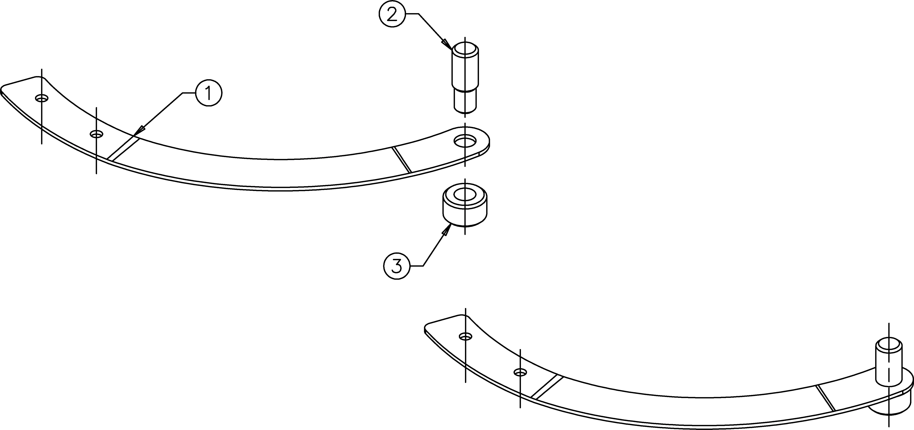

<!-- PROJECT LOGO -->

  
  <h3 align="center">ENIGMA I - Dora Reflector</h3>
  

    Serial Number: 24b 656 
    Year of manufacturing: 1943 
    Chiffriermaschinen AG Heimsoeht & Rinke in Berlin-Wilmersdorf
  

<!-- TABLE OF CONTENTS -->
- [Project Status](#project-status)
- [Rack/Plug Board - Gestell/Steckerbrett](#rackplug-board---gestellsteckerbrett)
- [Reflector - Umkehrwalze (UKW)](#reflector---umkehrwalze-ukw)
  - [Complete Reflector](#complete-reflector)
- [Rotor - Walzensatz](#rotor---walzensatz)
  - [Rollbody](#rollbody)
  - [Clamp](#clamp)
  - [Complete Rotor](#complete-rotor)
  - [Rotors Stacking](#rotors-stacking)
- [Internal Wiring](#internal-wiring)
  - [Reflector](#reflector)
  - [Rotors](#rotors)
- [Material Designation](#material-designation)
- [Acknowledgements](#acknowledgements)

<!-- ABOUT THE PROJECT -->
## Why <!-- omit from toc -->
This project was created to transfer the blueprints of every single component of an ENIGMA I cipher device in a digital format (.stl, in the future other formats will be available) useful for 3D printing and eventual production through Computer-aided manufacturing (CAM).

The idea originated from my desire to improve my skills in 3D modeling choosing a device that has always fascinated me. At the same time, the project was intended to be useful by providing the community with resources that were not yet available online.

<!-- PROJ STATUS -->
## Project Status

| Module | Total Parts | Completed Parts | Percentage |
| :---: | :---: | :---: | :---: |
| Rack/Plug Board | 73 | 2 |   |
| Reflector | 15 | 15 |   |
| Rotor | 19 | 19 |   |

<!-- RACK -->
## Rack/Plug Board - Gestell/Steckerbrett

| POS | Part Nr | Name | Material designation | Weight (Kg) |
| :---: | :---: | :---: | :---: | :---: |
| x | <a href="https://github.com/AresValley/ENIGMA/tree/master/rack/100001">100 001</a> | Bearing Block Left | <a href="#material-designation">S235JR</a> | 0.155 |
| x | <a href="https://github.com/AresValley/ENIGMA/tree/master/rack/100005">100 005</a> | Shaft Holder | <a href="#material-designation">S235JR</a> | 0.019 |

<!-- REFLECTOR -->
## Reflector - Umkehrwalze (UKW)
The **reflector** known as the **reversing drum** or, from the German, the **umkehrwalze** (**UKW**) is a fixed wiring mechanism within the Enigma machine. After the input character is encoded by passing through a series of rotating cipher wheels (known as rotors, see below), the signal would then be sent to the Reflector and back to rotors again. Instead of producing a new letter substitution, the Reflector's purpose was to create a reciprocal mapping of letters, effectively ensuring that the encryption process is symmetric. This means that if a letter "A" was encrypted as "D," the decryption process would reverse this, decrypting "D" back to "A". Enigma can then be used to both encrypt or decrypt a message using the same initial settings. Unfortunately, incorporating a reflector into the system introduces an encryption vulnerability: the encrypted version of a given letter can never be that letter itself.

### Complete Reflector

| POS | Nr | Ref | Name | Material designation | Weight (Kg) |
| :---: | :---: | :---: | :---: | :---: | :---: |
| 1 | 1 | <a href="https://github.com/AresValley/ENIGMA/tree/master/reflector/300009">300 009</a> | Axle | <a href="#material-designation">S235JR</a> | 0.0004 |
| 2 | 1 | <a href="https://github.com/AresValley/ENIGMA/tree/master/reflector/300002">300 002</a> | Cabinet | <a href="#material-designation">MATERIAL</a> | 0.1364 |
| 3 | 4 | | Countersink M2 x 4 | |
| 4 | 3 | | Countersink M3 x 6 | |
| 5 | 1 | <a href="https://github.com/AresValley/ENIGMA/tree/master/reflector/300003">300 003</a> | Wedge Holder | <a href="#material-designation">S235JR</a> | 0.0529 |
| 6 | 2 | <a href="https://github.com/AresValley/ENIGMA/tree/master/reflector/300004">300 004</a> | Wedge | <a href="#material-designation">S235JR</a> | 0.0096 |
| 7 | 4 | | Countersink M3 x 5 | |
| 8 | 3 | | Screw M1.6 x 4 | |
| 9 | 1 | <a href="https://github.com/AresValley/ENIGMA/tree/master/reflector/300008">300 008</a> | Isolator Plate | <a href="#material-designation">PA6 (Black)</a> | 0.0002 |
| 10 | 24 | <a href="https://github.com/AresValley/ENIGMA/tree/master/reflector/300005">300 005</a> | Blank | <a href="#material-designation">CuZn40</a> | 0.0003 |
| 11 | 26 | <a href="https://github.com/AresValley/ENIGMA/tree/master/rotors/400010">400 010</a> | Contact Die | <a href="#material-designation">CuZn40</a> | 0.0001 |
| 12 | 6 | <a href="https://github.com/AresValley/ENIGMA/tree/master/rotors/400013">400 013</a> | Thread Bushing | <a href="#material-designation">S235JR</a> | 0.0011 |
| 13 | 3 | <a href="https://github.com/AresValley/ENIGMA/tree/master/rotors/400019">400 019</a> | Thread Bushing Small | <a href="#material-designation">S235JR</a> | 0.0004 |
| 14 | 1 | <a href="https://github.com/AresValley/ENIGMA/tree/master/reflector/300001">300 001</a> | Reverse Roll | <a href="#material-designation">PA6 (Black)</a> | 0.0044 |
| 15 | 2 | <a href="https://github.com/AresValley/ENIGMA/tree/master/reflector/300007">300 007</a> | Screw Plate | <a href="#material-designation">S235JR</a> | 0.0001 |
| 16 | 24 | <a href="https://github.com/AresValley/ENIGMA/tree/master/reflector/300006">300 006</a> | Bushing | <a href="#material-designation">CuZn40</a> | 0.0019 |
| 17 | 26 | <a href="https://github.com/AresValley/ENIGMA/tree/master/rotors/400017">400 017</a> | Spring | <a href="#material-designation">CuZn40</a> | 0.0000 |
| 18 | 26 | <a href="https://github.com/AresValley/ENIGMA/tree/master/rotors/400018">400 018</a> | Spring Pin | <a href="#material-designation">CuZn40</a> | 0.0003 |
| 19 | 1 | <a href="https://github.com/AresValley/ENIGMA/tree/master/rotors/400015">400 015</a> | Coping | <a href="#material-designation">PA6 (Black)</a> | 0.0065 |
| 20 | 3 | | Countersink M3x8 | |

<!-- ROTORS -->
## Rotor - Walzensatz 

### Rollbody

| POS | Part Nr | Name | Material designation | Weight (Kg) |
| :---: | :---: | :---: | :---: | :---: |
| 1 | <a href="https://github.com/AresValley/ENIGMA/tree/master/rotors/400012">400 012</a> | Steel Bushing | <a href="#material-designation">S235JR</a> | 0.0084 |
| 2 | <a href="https://github.com/AresValley/ENIGMA/tree/master/rotors/400016">400 016</a> | Contact Pin | <a href="#material-designation">CuZn40</a> | 0.0003 |
| 3 | <a href="https://github.com/AresValley/ENIGMA/tree/master/rotors/400011">400 011</a> | Rollplate | <a href="#material-designation">PA6 (Black)</a> | 0.0090 |
| 4 | <a href="https://github.com/AresValley/ENIGMA/tree/master/rotors/400010">400 010</a> | Contact Die | <a href="#material-designation">CuZn40</a> | 0.0001 |
| 5 | <a href="https://github.com/AresValley/ENIGMA/tree/master/rotors/400009">400 009</a> | Center Toothed Wheel | <a href="#material-designation">PA6 (Black)</a> | 0.0345 |
| 6 | <a href="https://github.com/AresValley/ENIGMA/tree/master/rotors/400019">400 019</a> | Thread Bushing Small | <a href="#material-designation">S235JR</a> | 0.0004 |
| 7 | <a href="https://github.com/AresValley/ENIGMA/tree/master/rotors/400017">400 017</a> | Spring | <a href="#material-designation">CuZn40</a> | 0.0000 |
| 8 | <a href="https://github.com/AresValley/ENIGMA/tree/master/rotors/400018">400 018</a> | Spring Pin | <a href="#material-designation">CuZn40</a> | 0.0003 |
| 9 | <a href="https://github.com/AresValley/ENIGMA/tree/master/rotors/400013">400 013</a> | Thread Bushing | <a href="#material-designation">S235JR</a> | 0.0011 |
| 10 | <a href="https://github.com/AresValley/ENIGMA/tree/master/rotors/400014">400 014</a> | Toothed Wheel | <a href="#material-designation">S235JR</a> | 0.1140 |
| 11 | <a href="https://github.com/AresValley/ENIGMA/tree/master/rotors/400015">400 015</a> | Coping | <a href="#material-designation">PA6 (Black)</a> | 0.0065 |
| 12 | | Countersink M3 x 8 | |

### Clamp

| POS | Part Nr | Name | Material designation | Weight (Kg) |
| :---: | :---: | :---: | :---: | :---: |
| 1 | <a href="https://github.com/AresValley/ENIGMA/tree/master/rotors/400006">400 006</a> | Clamp | <a href="#material-designation">38Si7</a> | 0.0013 |
| 2 | <a href="https://github.com/AresValley/ENIGMA/tree/master/rotors/400007">400 007</a> | Pin | <a href="#material-designation">S235JR</a> | 0.0004 |
| 3 | <a href="https://github.com/AresValley/ENIGMA/tree/master/rotors/400008">400 008</a> | Cap | <a href="#material-designation">S235JR</a> | 0.0004 |

### Complete Rotor

| POS | Part Nr | Name | Material designation | Weight (Kg) |
| :---: | :---: | :---: | :---: | :---: |
| 1 | <a href="https://github.com/AresValley/ENIGMA/tree/master/rotors/400003">400 003</a> | Bushing | <a href="#material-designation">S235JR</a> | 0.0540 |
| 2 | | Countersink M2 x 5 | |
| 3 | <a href="https://github.com/AresValley/ENIGMA/tree/master/rotors/400001">400 001</a> | Kerfring | <a href="#material-designation">S235JR</a> | 0.0169 |
| 4 | <a href="https://github.com/AresValley/ENIGMA/tree/master/rotors/400002">400 002</a> | Digitring | <a href="#material-designation">X12Cr13</a> | 0.1130 |
| 5 | <a href="https://github.com/AresValley/ENIGMA/tree/master/rotors/400005">400 005</a> | Bracket | <a href="#material-designation">S235JR</a> | 0.0020 |
| 6 | | [Clamp](#2-clamp) | |
| 7 | | Countersink M1.6 x 2.5 | |
| 8 | | Washer M1.2 | |
| 9 | | Screw M1.2 x 2 | |
| 10 | | Countersink M1.6 x 4 | |
| 11 | | [Rollbody](#1-rollbody) | |

### Rotors Stacking

| POS | Part Nr | Name | Material designation | Weight (Kg) |
| :---: | :---: | :---: | :---: | :---: |
| 1 | <a href="https://github.com/AresValley/ENIGMA/tree/master/rotors/400004">400 004</a> | Roll Shaft | <a href="#material-designation">S235JR</a> | 0.0270 |
| 2 | | Rotor III | |
| 3 | | Rotor IV | |
| 4 | | Rotor V | |

<!-- Internal Wiring -->
## Internal Wiring

<!-- REFLECTOR WIRING -->
### Reflector

The wiring of each rotor is referred to the sequence of the **eintrittzwalze** (**ETW**, entry disk) located on the right of the first rotor.

|  |  | Notch | Turnover |
| :---: | :---: | :---: | :---: |
| ETW | **ABCDEFGHIJKLMNOPQRSTUVWXYZ** | - | - |
| UKW-A	| EJMZALYXVBWFCRQUONTSPIKHGD | - | - |
| UKW-B	| YRUHQSLDPXNGOKMIEBFZCWVJAT | - | - |
| UKW-C	| FVPJIAOYEDRZXWGCTKUQSBNMHL | - | - |
| UKW-D (Dora) | rewirable / custom | - | - |

<!-- ROTORS WIRING -->
### Rotors

|  |  | Notch | Turnover |
| :---: | :---: | :---: | :---: |
| ETW | **ABCDEFGHIJKLMNOPQRSTUVWXYZ** | - | - |
| I	| EKMFLGDQVZNTOWYHXUSPAIBRCJ | Y | Q |
| II	| AJDKSIRUXBLHWTMCQGZNPYFVOE | M | E |
| III	| BDFHJLCPRTXVZNYEIWGAKMUSQO | D | V |
| IV | ESOVPZJAYQUIRHXLNFTGKDCMWB | R | J |
| V | VZBRGITYUPSDNHLXAWMJQOFECK | H | Z |

<!-- MD -->
## Material Designation

### S235JR <!-- omit from toc -->
**S235JR** is a European standard non-alloy, low carbon, manganese-containing structural steel commonly supplied in the untreated or normalised condition. It is easy to weld and bend. Similar desginations are: **SS1312**, **1.0038**, **Fe 360 BFN**, **RSt37-2**, **40 B**, **SB1312**, **IM2191**.

### X12Cr13 <!-- omit from toc -->
Martensitic grade chromium steel which exhibits good mechanical properties coupled with good corrosion resistance in moderately corrosive environments. It is used for the production of components working in contact with water and steam. It exhibits very good resistance to adipic, arsenic, benzoic, boric, maleic, gallic, and malic acid, or at low temperatures or concentrations to: nitric, chromic, gallotannic, carbolic, barium, aluminum, and potassium acids, and ammonium hydroxide. It is not resistant to salts and sulfur compounds. It does not exhibit significant strength properties compared to conventional structural steels due to its relatively low carbon content, but unlike steels with a higher carbon content, it is more resistant to corrosion.

### 38Si7 <!-- omit from toc -->
Medium-carbon spring steel used in quenched and tempered condition. The primary designation is to have high yield strength and resilience. For this, it is used for spring rings, spring plates, screw locks and load securing devices. It has a very low density among EN wrought alloy steels. In addition, it has a moderately low embodied energy and a very low base cost. Similar desginations are: **EN 1.5023**

### CuZn40 <!-- omit from toc -->
A copper-zinc alloy with a duplex alpha-plus-beta phase structure and excellent hot-working properties. Service environment must be considered to predict corrosion behaviour. **CuZn40** has somewhat better cold-working and joining properties, but is less readily machined, than the similar low-leaded alloy **CuZn40Pb**. The most commonly used wrought forms are plate, rod and sections/shapes.

### PA6 <!-- omit from toc -->
Polyamide 6, also known as Nylon 6 is a widely used industrial polymer. Nylon 6 fibres are tough, possessing high tensile strength, as well as elasticity and lustre. They are wrinkleproof and highly resistant to abrasion and chemicals such as acids and alkalis.

### POM-C <!-- omit from toc -->
Polyacetal, also commonly known as acetal or polyoxymethylene, is a formaldehyde-based, semi-crystalline engineering thermoplastic. It is widely used in the production of precision parts for applications demanding good dimensional stability and sliding properties. The polymer serves as an alternative to metals due to its low friction and wear characteristics as well as its excellent balance of mechanical and chemical properties.

<!-- ACKNOWLEDGEMENTS -->
## Acknowledgements
Thanks to Ms. Luzia Jans for providing all the drawings/blue prints in the context of the scientific project "DIE ENIGMA - Nachbau der legendaeren Chiffriermaschine". The original ENIGMA machine (serial 24b 656) on which all the drawings are based, is present in the Wehrtechnische Studiensammlung museum in Koblenz (Germany).

