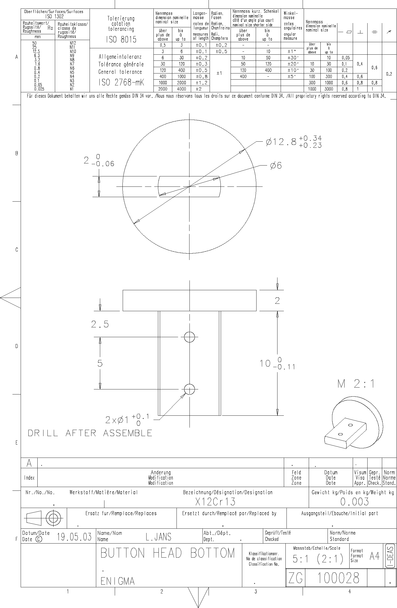

<!-- PROJECT LOGO -->

  

<!-- ABOUT THE PROJECT -->
## BUTTON HEAD BOTTOM - 100 028

**ID:** 100028  
**Material:** [X12Cr13](https://github.com/AresValley/ENIGMA#x12cr13-)  
**Weight:** 2.92 g  
**A360:** https://a360.co/3OeWTD0  

### Blueprint
