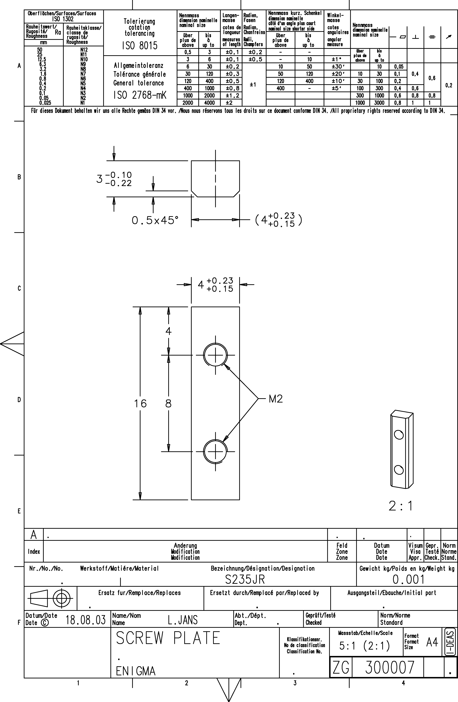

<!-- PROJECT LOGO -->

  

<!-- ABOUT THE PROJECT -->
## SCREW PLATE - 300 007

**ID:** 300007  
**Material:** [S235JR](https://github.com/AresValley/ENIGMA#s235jr)  
**Weight:** 1.4 g  
**A360:** https://a360.co/45DTMM4  

### Blueprint
