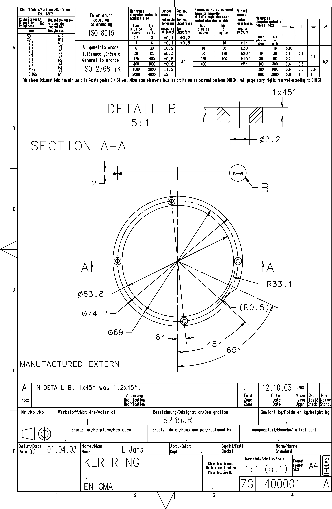

<!-- PROJECT LOGO -->

  

<!-- ABOUT THE PROJECT -->
## KERFRING - 400 001

**ID:** 400001  
**Material:** S235JR (non-alloy, low carbon, manganese-containing structural steel)  
**Weight:** 0.0169 Kg  
**A360:** https://a360.co/2ZTC5rj  

### Blueprint
