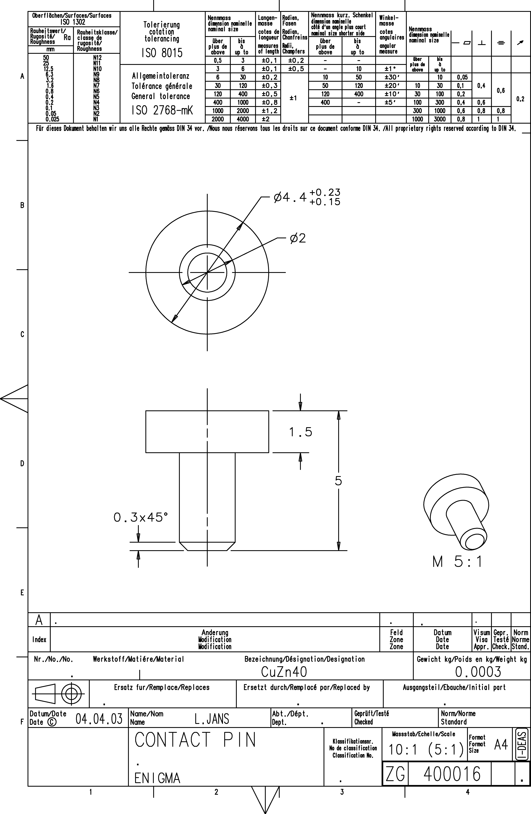

<!-- PROJECT LOGO -->

  

<!-- ABOUT THE PROJECT -->
## CONTACT PIN - 400 016

**ID:** 400016  
**Material:** CuZn40 (copper-zinc alloy that relates to semi-red brasses)  
**Weight:** 0.0003 Kg  
**A360:** https://a360.co/3pN8evb  

### Blueprint
